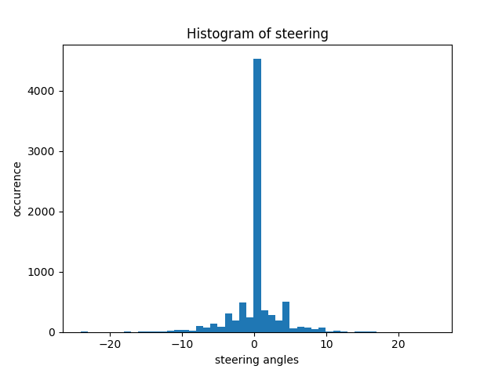
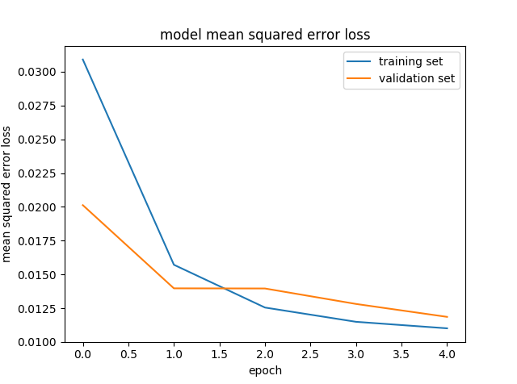
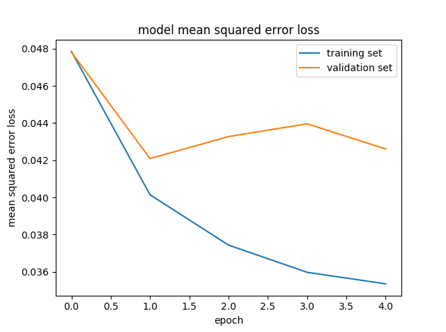

#**Behavioral Cloning** 

##Project report
---

**Behavioral Cloning Project**

The goals / steps of this project are the following:
* Use the simulator to collect data of good driving behavior
* Build, a convolution neural network in Keras that predicts steering angles from images
* Train and validate the model with a training and validation set
* Test that the model successfully drives around track one without leaving the road
* Summarize the results with a written report

---
##Files
The files submited are as follow:

 - model.py containing the script to create and train the model 
 - drive.py for driving the car in autonomous mode 
	 - note: the drive.py have not been modified from the one supplied since all the pre-processing was performed within "keras"
 - model.h5 containing a trained convolution neural network
 - run.mp4 a video of a lap around the first track
- Readme.md this document which sumarize the results

- Note: a second set of files is proposed for a minimal solution to the problem:
	- model_simplified which is a second iteration of a simplified NN
	- model_simplified.h5 the associated model storage
	- run_simplified the associated video

##Data capture
I collected data by driving around the first tracks normally for about one lap.
 - The data pool is a little bit limited (~8000 images before data augmentation ) but is suits my old graphic card and seems to be enough to get a decent result.
 - The driving was performed using only the keyboard as input, it is not an ideal situation but does not seems to affect the final result.
 - The steering distribution show a main zero steering and a few extreme values 

  

##Data treatment and allocation

 - The data pool was doubled by being flipping the images horizontally, then tripled bu using the right and left camera data with a
   correction factor of 0.2
 - The data was pre-processed by cropping, centring and  intensity    
   normalisation using a Keras lambda layer.
 - 20% of the total data was used for test and 80% for    training

##NN model

The architecture post (cropping, cantering and normalisation) is a simple one :

 1. convolution, (input size : 160 x 320 x 3 ) => (output size : 45 x  160 x  6)
 2. 'relu' activation=> (output size : 45 x 160 x  6)
 3. MaxPooling  => (output size 22 x 80 x 6)
 4. convolution =>  (output size 11 x, 40 x 6)
 5. 'relu' activation=>  (output size 11 x, 40 x 6)
 6. MaxPooling  => (output size 5 x 20 x 6)
 7. flattening =>    (output size 600)
 8. fully connected NN => (output size 120)
 9. fully connected NN => (output size 84)
 10. fully connected NN => (output size 1)

Train on 38572 samples
validate on 9644 samples

I optimized the model with an Adam optimizer over MSE loss. 
I used the default adam optimizer rate of 0.001

##Model results

 - I received a final training loss of ~0.005 and a validation loss of
   ~0.012.

  

 - Qualitatively, the model drives the car well on the first track.
 

  

 - The model contains no dropout layers since I have not seen any evidence of over fitting.
 - The vehicle is able to drive autonomously around the first track without leaving the road. Nevertheless it is getting out of the road quickly in the second track. This is not surprising since: 
	 - the model has been trained on a very limited set of images
	 - the training images do not inclide images from the second track
	 - The NN model used is not very shallow and may not have enough degree of freedom to capture the increased complexity of the second track
##Analysis and simplification

- I have try to understand how the model was working, and arrive to the conclusion that the model correlates the bend of the road with the steering angle. With the bending of the road being defined by the centre of gravity of the road image intensity which is shifts from right to left with the road curvature.

- To prove the point I have designed a mini neural network to drive the car on a very narrow band of road.
### simplified model pre processing
after the image normalization and centring, only a 9 pixel height horizontal band of image is kept for processing.

1. crooping (inputsize: 160 x 320 x 3) => (output size = 9 x 320 x 3) 

After this massive cropping, I use the convolution layer to average the band itensity into an horizontal line.
The rest of the layers are just there to close the net.

1. convolution, (input size : 9 x 320 x 3 ) => (output size : 5 x  160 x  1)
2. 'relu' activation => (output size : 5 x 160 x  6)
3. MaxPooling  => (output size 2 x 80 x 6)
4. flattening =>  (output size 960)
5. fully connected NN => (output size 1)

to help the model work I have as well increased the correction factor to 0.3 to force the vehicle toward the road centre.

note: The driving.py file is not modified

###Simplified model results

The model convergence is not great with a 5% error on the validation set, nevertheless ths seems sufficient to drive the first track.

  

On the first track this minimal NN seems to work surprisingly well, even
   if it tends to get close to the outer lines in one area.

- see video run_simplified.mp4

